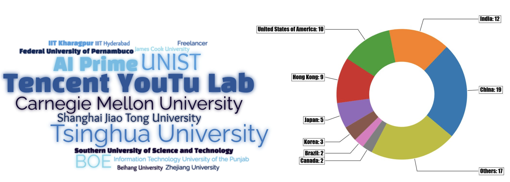
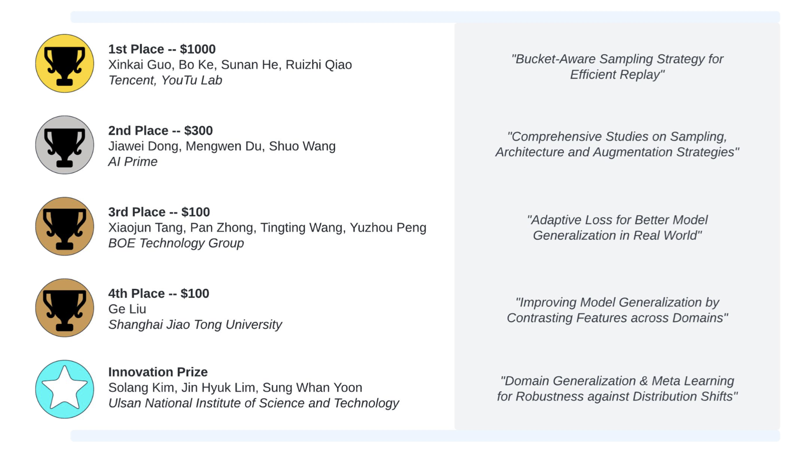

# 1st CLEAR Challenge (CVPR'22)

The [1st CLEAR challenge](https://www.aicrowd.com/challenges/cvpr-2022-clear-challenge) was hosted on [CVPR'22 Open World Vision workshop](https://www.cs.cmu.edu/\~shuk/vplow.html) in June 19th, 2022. Through the challenge, we hope to encourage the continual learning (CL) community to embrace real-world CL problem by:

* Working on scenarios with **natural distribution shifts**, e.g., CLEAR-10 and CLEAR-100.
* Addressing the **generalization bottleneck** of practical CL systems, especially the train-test domain gap and forward transfer.
* **Not limiting the replay buffer size** (unlike in most prior works) because memory cost is usually not the bottleneck. Instead, we use a more realistic proxy of total training cost, that is to limit the **training time per bucket** to be 12hr (on a single 2080ti, see this [chart](https://mtli.github.io/gpubench/) for conversion to other types of GPU).

At the end of the challenge, we have 79 participants from 21 different countries and region joining the challenge, and together they pushed the state-of-the-art on CLEAR-10/CLEAR-100 to another level.&#x20;

Top performing teams in this challenge adopt various stratgies to improve the generalization bottleneck, such as:

* _Experience Replay_ for more efficient usage of diverse training samples.
* _Data augmentation_, e.g., Cutmix, Mixup, etc., for improving data efficiency.
* _Special losses to improve generalization_, e.g., sharpness aware minimization, contrastive-based representation learning, etc.

Please checkout the [slides](https://linzhiqiu.github.io/papers/clear/clear\_cvpr.pdf) for a quick summary of the workshop.

## Workshop result&#x20;

1st Place (Youtu Lab) summary video | (code to be released soon):

2nd Place (AI Prime) [solution code](https://github.com/eashenyang/CLEAR-AIPrime)

3rd Place (BOE) code to be released
