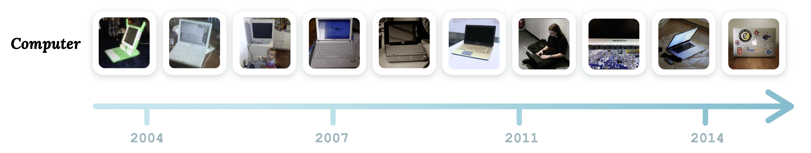

# Motivation of CLEAR Benchmark

## Why Continual Learning?

Most of the successes in nowadays vision and learning community are achieved on **static benchmarks** that did not change ever since they are released:

In real world, such "IID" assumption does not usually hold. Therefore, researchers have put efforts in the field of **continual (or incremental/lifelong) learning**, aiming for learning systems that are **more robust under distribution shifts**.&#x20;

Yet, most of the existing works focus on combatting the **catastrophic forgetting** nature of neural networks, a phenomenon commonly observed on popular continual benchmarks with **extreme distribution shifts between tasks** such as "_Permuted-MNIST_", "_Split-CIFAR_", "_Incremental-ImageNet_", and so on..

Made from existing vision datasets, these benchmarks usually contain **synthetic distribution shifts** via randomly shuffling pixels, or splitting labels into disjoint subsets. Instead, we posit that **a more practical continual learning benchmark should reflect how the real world is changing**, such as when AVs moving to a new city, and when seeing brand new car models:

## Temporal Evolution of Visual Concepts

In the context of visual recognition, we observe that a lot of visual concepts in Internet imagery are evolving over time, i.e., temporal evolution of visual concepts.

Therefore, we propose to make the CLEAR benchmark featuring such natural continual learning scenarios. We select dynamic visual concepts that are common in Internet image collections to form the label space of [CLEAR-10](../documentation/download-clear-10-clear-100.md#clear-10-s3-download-links) and [CLEAR-100](../documentation/download-clear-10-clear-100.md#clear-100-s3-download-links).

We will discuss next how we curate the CLEAR benchmark with an efficient visio-linguisitic dataset curation approach, as well as some of the valuable assets made available for the vision\&learning community.
