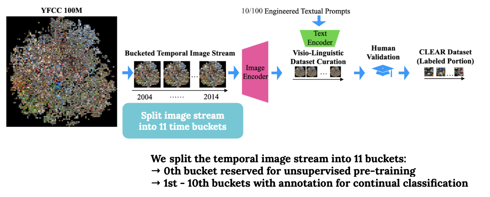

# Visio-Linguistic Dataset Curation

We start from the public [YFCC100M](http://projects.dfki.uni-kl.de/yfcc100m/) collection that contains Flickr images uploaded between 2004 and 2014. We downloaded a 8M subset to build CLEAR-10, and a 40M subset to build CLEAR-100.

We use the **upload time** to recreate the temporal stream and split the 8M/40M into **11 buckets of images**, each spanning on average 1 year. The 0th bucket is reserved for unsupervised pre-training (e.g., MoCo), and we curate a small but **high-quality labeled set** (with CLEAR-10 and CLEAR-10 ontology defined [here](about-clear-benchmark.md#temporal-evolution-of-visual-concepts)) for **each of the 1st to 10th buckets**.&#x20;

To avoid excessive human annotation cost on web-scale data, we use the visio-linguistic dataset curation approach proposed in our [NeurIPS'21 paper](https://arxiv.org/pdf/2201.06289.pdf). The key idea is to leverage OpenAI's recent [CLIP](https://openai.com/blog/clip/) model and prompt engineering techniques for efficient image retrieval. The top-scoring images retrieved by CLIP are later verified by human annotators to ensure 99% precision (crowdsourced [MTurk](https://www.mturk.com) workers for CLEAR-10 and c[ommericial labelling service](https://stardust-ai.com) for CLEAR-100).

The entire pipeline can be summarized:

## Assets for Future Research

In addition to the high-quality labeled subset, we also release a wealth of assets per time bucket for future research on continual learning, including:

* _**Abundant unlabeled data**: For research on **unsupervised continual learning**. This includes \~0.8M unlabeled images per bucket for CLEAR-10, and \~3.6M unlabeled images per bucket for CLEAR-100._
* _**Metadata**: For research on **continual multi-modal learning**. This includes all the YFCC100M released metadata such as upload and captured timestamps, captured location, social media hashtags, user description, image title, and etc._
* _**Instruction sets for human annotation**: For improving **dataset**_** transparency**. CLEAR-10 instruction set on MTurk platform can be found in the supplemental of [NeurIPS'21 paper](https://arxiv.org/pdf/2201.06289.pdf). CLEAR-100 instruction set can be found here ([Chinese ver.](https://linzhiqiu.github.io/papers/clear/clear100\_chinese.pdf)).
